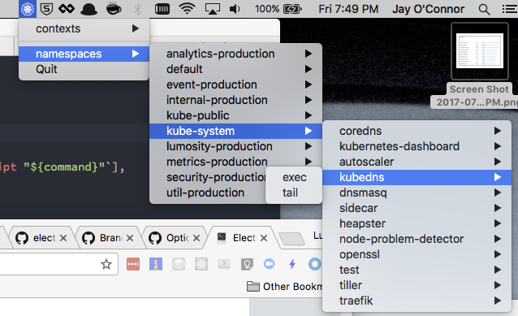

# kubectlmenu
Electron App that works with the Mac menu bar to give quick access to kubectl commands



### How to run this thing

First, install dependencies:

```
yarn install
```

Next, run with Electron:

```
electron .
```
